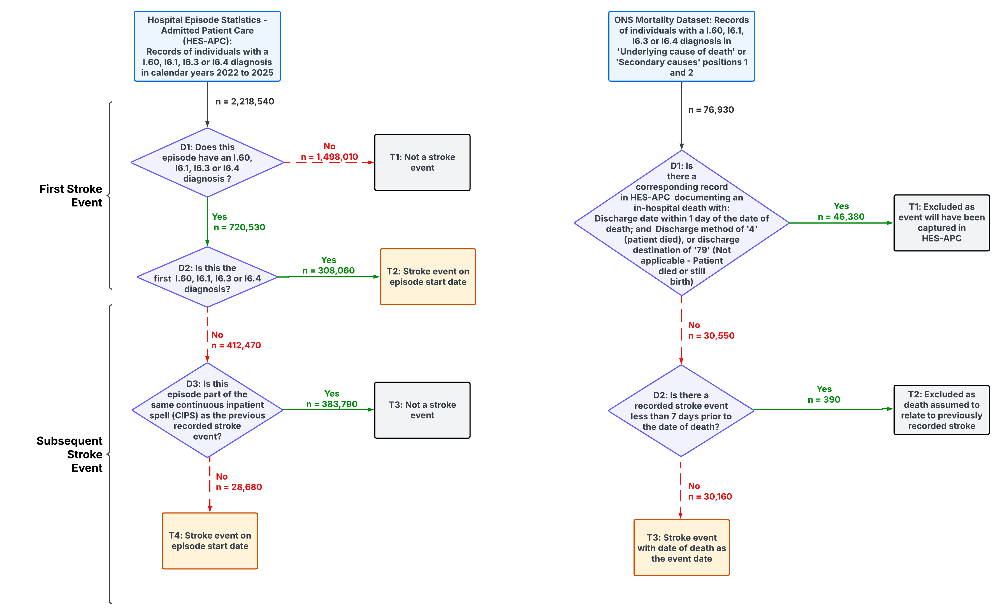
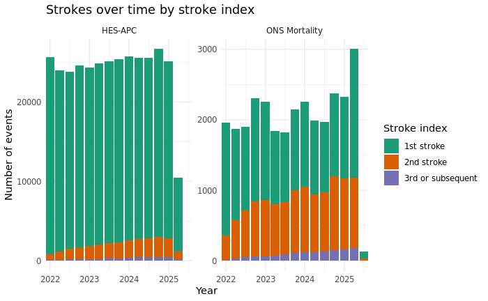
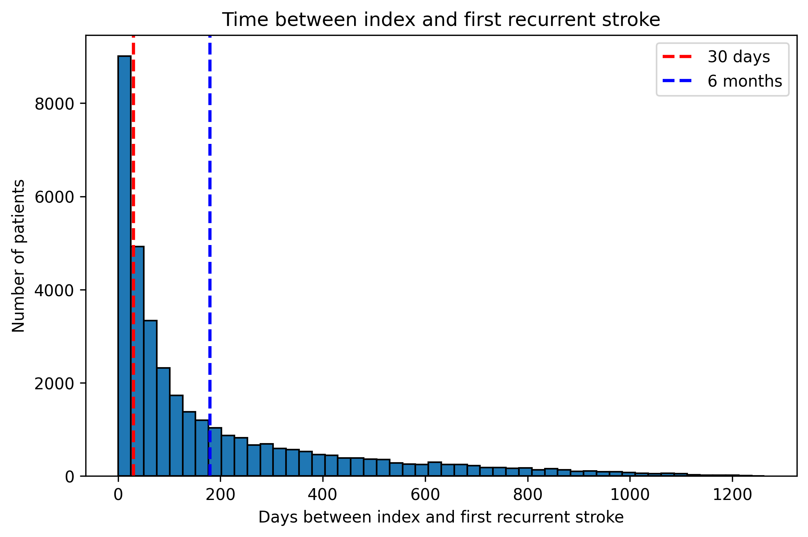
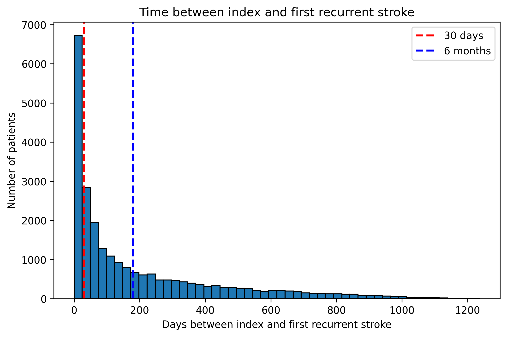
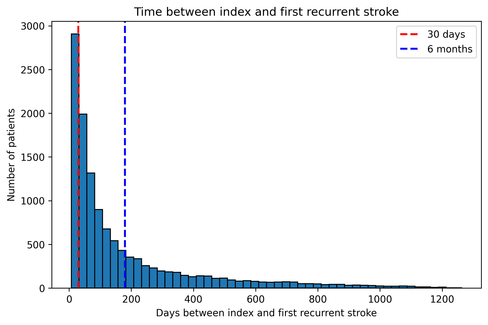
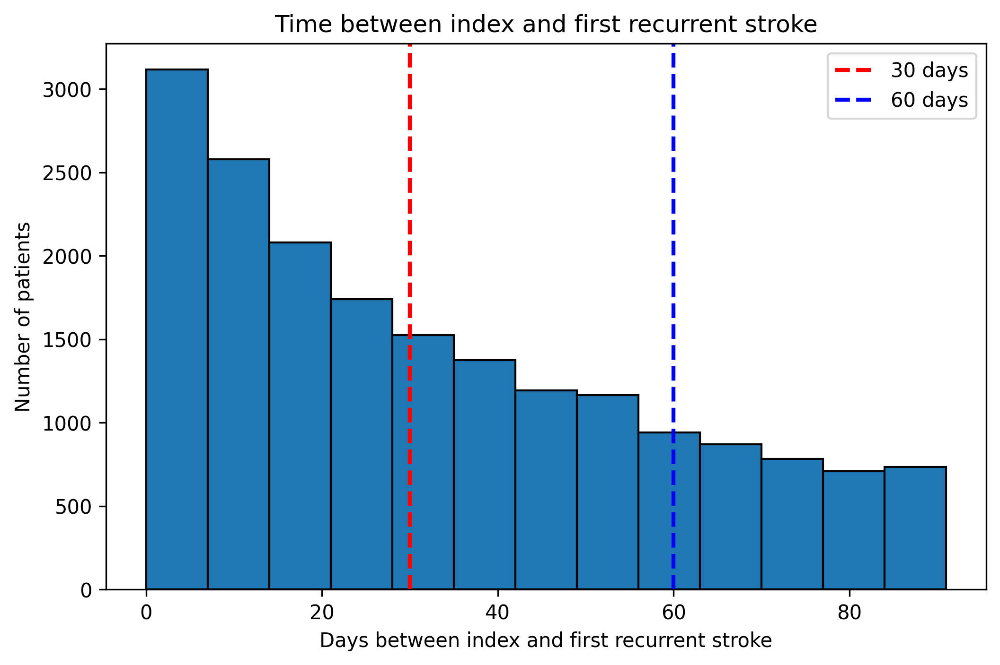
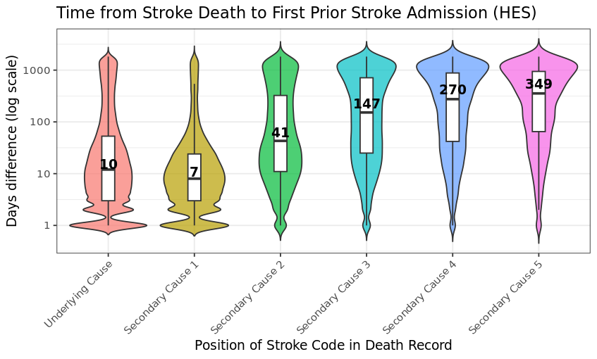
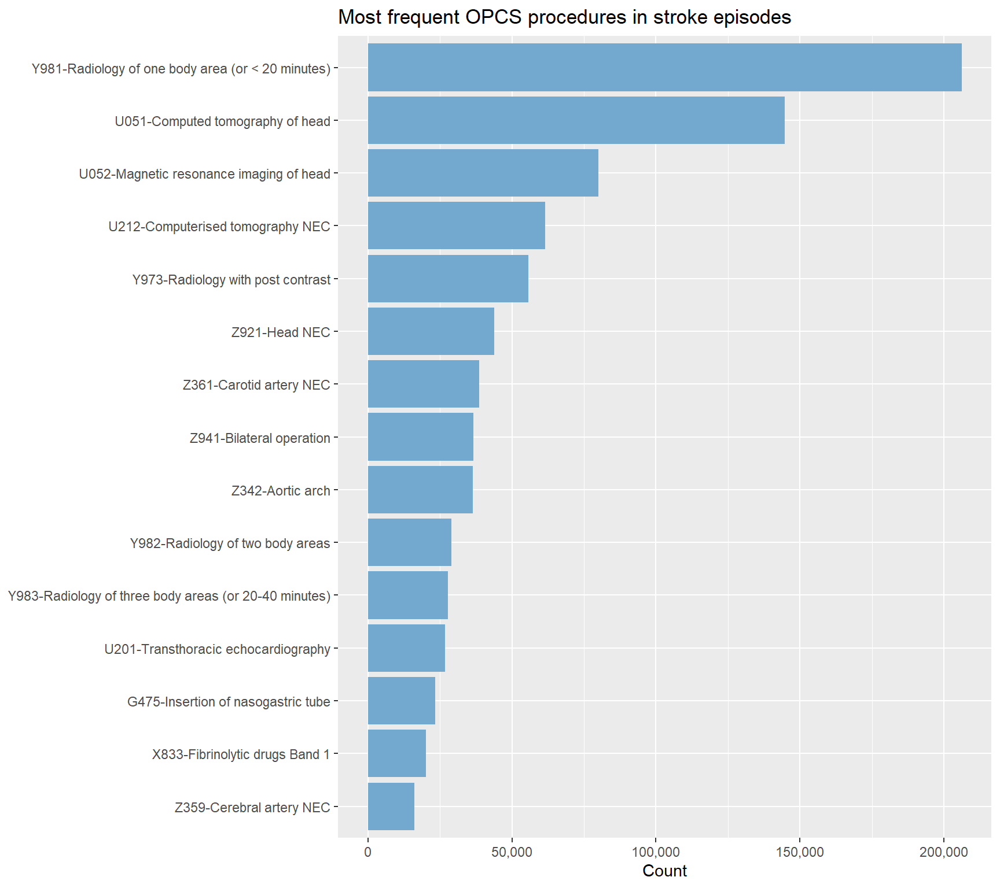

# Stroke Algorithm - Explorations of the Data

#### Author: Laura Sherlock

#### August 28, 2026

Under the SCORE-CVD project we aimed to create an algorithm which can reliably detect stroke events in secondary care (HES APC) and death records (ONS mortality). Whilst detecting first stroke events is relatively straightforward, detecting recurrent stroke is more complex and required further exploration of the data.  
  
In the course of this project we created multiple versions of the algorithm, as well as some explorations of the data to better inform further iterations.  
  
Following our explorations of the data and outputs of the various versions of the algorithm, we ultimately decided that a one size fit all algorithm was not going to be useful for detecting stroke in HES APC and ONS deaths data, and that the algorithm would needed would differ based on the cohort it is being applied to or the aims of the research.  
Thus the final version of the algorithm (flowchart [here](https://github.com/BHFDSC/hds_phenotyping_score_cvd_stroke/tree/main/Databricks_implementation_of_stroke_algorithm/docs)) allows for the user to set many flexible parameters based on their needs.  
These include:  
- The stroke ICD-10 codes used to flag stroke events  
- The subtype labels applied to to groups of ICD-10 codes  
- The position in the HES and Deaths records accepted for first and subsequent strokes  
- Washout period between strokes during which new stroke events will not be counted  
- Days post stroke which death from any cause is counted as a stroke death  
  
Both a Databricks and R implementation of the algorithm are available [here](https://github.com/BHFDSC/hds_phenotyping_score_cvd_stroke/tree/main). Please see the README for more information on the final stroke algorithm and to view the default parameters.  
  
In the document below we display the first version of the algorithm, and some explorations of the data which helped inform our decisions to make the algorithm flexible, and which informed some of the default values set.  
  
The algorithm has been developed using HES APC and ONS deaths records during the period 2022.01.01 and 2025.12.31.  
Note that counts have been rounded to the nearest 5, and values under 10 redacted, as per NHS SDE guidelines.  

# 1 Glossary

To place the work presented in this document in context the below table explains some of the key terms.

| Term                              | Definition                                                                                                                       | Notes                                                                                                                                          |
|-----------------------------------|----------------------------------------------------------------------------------------------------------------------------------|------------------------------------------------------------------------------------------------------------------------------------------------|
| admidate                          | The date of admission to hospital for an inpatient stay.                                                                         | Represents the start of the hospital spell; may precede multiple episodes.                                                                     |
| Continuous Inpatient Spell (CIPS) | A patient’s uninterrupted stay in hospital, potentially across multiple wards or hospitals, without discharge to home in between | Used to consolidate multiple episodes for a single clinical admission and avoid double-counting.                                               |
| epiend                            | The date on which a consultant episode ends.                                                                                     | Marks the end of an episode and may coincide with transfer to another consultant or discharge.                                                 |
| epikey                            | A unique identifier for each consultant episode in HES-APC.                                                                      | Used to distinguish different episodes within the same hospital admission.                                                                     |
| Episode                           | A period of care under a single consultant within one hospital stay.                                                             | Multiple episodes can occur within a single admission or CIPS.                                                                                 |
| epistart                          | The date on which a consultant episode begins.                                                                                   | Marks the start of a new episode within an inpatient stay.                                                                                     |
| HES-APC                           | Hospital Episode Statistics – Admitted Patient Care                                                                              | National administrative dataset of all inpatient hospital admissions in England. Includes diagnostic and procedural coding for each admission. |
| ICD-10 codes                      | International Classification of Diseases, 10th Revision                                                                          | Standardised coding system for diagnoses. Codes I21 and I22 are used for acute myocardial infarction and subsequent myocardial infarction.     |
| LSOA                              | Lower Layer Super Output Area                                                                                                    | A unique identifier for a small geographic area in England or Wales, designed to contain a population of between 1,000 and 3,000 residents.    |
| ONS Deaths                        | Office for National Statistics Civil Registration of Deaths                                                                      | National dataset recording date and cause of death for all registered deaths in England.                                                       |
| OPCS code                         | Office of Population Censuses and Surveys Classification of Interventions and Procedures.                                        | Standardised coding system for procedures performed during an inpatient stay.                                                                  |
| person_id                         | A pseudonymised patient-level identifier used to link records for the same individual across datasets.                           | Not directly identifiable; enables longitudinal analysis.                                                                                      |
| procode                           | Provider code identifying the NHS trust or organisation responsible for delivering the care.                                     | Useful for analyses by healthcare provider.                                                                                                    |

Glossary of key terms

# 2 Flowcharts of Exclusion Criteria

## 2.1 Data cleaning exclusions in HES APC and ONS deaths

The below flowcharts illustrate some of the initial cleaning steps undertaken on the HES APC and ONS Deaths records, prior to any work related to stroke. It includes steps to exclude cases in which required variables such as a person_id or an episode date are omitted.

### 2.1.1 HES APC Exclusions

### 2.1.2 ONS Deaths Exclusions

## 2.2 Data cleaning exclusions applied to the cohort of individuals utilised in algorithm development

Flowchart illustrating exclusion criteria for final cohort utilised for the development of the stroke algorithm V1  
This cohort of individuals consists of people who do not have a stroke record in HES APC prior to 2022.01.01 (study start date), and excludes anyone with invalid NHS numbers, anyone outwith the study age range, anyone missing key demographic data, anyone not resident in England, or anyone without a record in GDPPR prior to study start

This gives us a cohort of 48,427,415 people without a stroke record prior to 2022.01.01 who are eligible for inclusion in the study/algorithm development cohort.  
We then restrict this cohort to only individuals who *have* a stroke code in the HES-APC records or ONS deaths records between 01.01.2022 and 2025.12.31. This gives us 2,218,540 records, relating to 308,060 individuals in the HES-APC records - and 76,930 records/individuals in the ONS deaths records. The stroke algorithm is run on these HES APC and ONS deaths records for illustration purposes.

# 3 Stroke Algorithm Version 1

Here we present the outputs relating to the first version of the stroke algorithm

## 3.1 Stroke Events

### 3.1.1 Flowchart of Stroke Events

Decision tree illustrating the logic of the algorithm  
The algorithm is applied to 308,060 individuals (2,218,540 records) in HES APC and 76,930 individuals in ONS deaths 

### 3.1.2 N Stroke events by source and index

Note: rows with counts under 10 have been removed as per SDE guidelines

| stroke_index | data_source   | n      |
|--------------|---------------|--------|
| 1            | HES-APC       | 308055 |
| 1            | ONS Mortality | 17620  |
| 2            | HES-APC       | 24525  |
| 2            | ONS Mortality | 11190  |
| 3            | HES-APC       | 3145   |
| 3            | ONS Mortality | 1160   |
| 4            | HES-APC       | 580    |
| 4            | ONS Mortality | 155    |
| 5            | HES-APC       | 150    |
| 5            | ONS Mortality | 25     |
| 6            | HES-APC       | 60     |
| 7            | HES-APC       | 30     |
| 8            | HES-APC       | 20     |
| 9            | HES-APC       | 15     |
| 10           | HES-APC       | 15     |
| 11           | HES-APC       | 10     |
| 12           | HES-APC       | 10     |
| 13           | HES-APC       | 10     |
| 14           | HES-APC       | 10     |
| 15           | HES-APC       | 10     |

Counts of stroke events by source and index

## 3.2 Stroke counts over time by data source and stroke occurence

The below plot illustrates the count of stroke events detected by the algorithm quarterly between the period 2022.01.01 and 2025.12.31, stratified by the data source (HES-APC or ONS deaths) and the stroke occurrence (1st, 2nd, third or subsequent stroke)  
Note that data in the current batch ends 31.05.2025 for both HES APC and ONS deaths - the algorithm will be rerun using future batches (currently run on batch with archived date 2025-07-28) 

## 3.3 Characteristics of Patients with Stroke

### 3.3.1 Table 1 by data source and stroke occurrence

<table>
<caption>Patient characteristics by data source and stroke occurrence</caption>
<colgroup>
<col style="width: 12%" />
<col style="width: 12%" />
<col style="width: 12%" />
<col style="width: 12%" />
<col style="width: 12%" />
<col style="width: 12%" />
<col style="width: 12%" />
<col style="width: 12%" />
</colgroup>
<thead>
<tr class="header">
<th colspan="2"></th>
<th colspan="3">HES-APC</th>
<th colspan="3">ONS Deaths</th>
</tr>
<tr class="odd">
<th></th>
<th></th>
<th>1st stroke event</th>
<th>2nd stroke event</th>
<th>3rd or subsequent stroke event</th>
<th>1st stroke event</th>
<th>2nd stroke event</th>
<th>3rd or subsequent stroke event</th>
</tr>
</thead>
<tbody>
<tr class="odd">
<td>Total N (%)</td>
<td></td>
<td>308055 (84.0)</td>
<td>24525 (6.7)</td>
<td>4155 (1.1)</td>
<td>17620 (4.8)</td>
<td>11190 (3.0)</td>
<td>1350 (0.4)</td>
</tr>
<tr class="even">
<td>Age (years)</td>
<td>Median (IQR)</td>
<td>75.8 (64.0 to 84.2)</td>
<td>75.5 (64.0 to 83.3)</td>
<td>72.6 (60.1 to 80.8)</td>
<td>84.3 (75.4 to 90.7)</td>
<td>86.5 (80.1 to 91.3)</td>
<td>83.1 (76.4 to 88.6)</td>
</tr>
<tr class="odd">
<td>Age group (years)</td>
<td>18-59</td>
<td>56925 (18.5)</td>
<td>4495 (18.3)</td>
<td>1035 (24.9)</td>
<td>1310 (7.4)</td>
<td>235 (2.1)</td>
<td>45 (3.3)</td>
</tr>
<tr class="even">
<td></td>
<td>60-69</td>
<td>54525 (17.7)</td>
<td>4470 (18.2)</td>
<td>810 (19.5)</td>
<td>1540 (8.7)</td>
<td>565 (5.0)</td>
<td>110 (8.1)</td>
</tr>
<tr class="odd">
<td></td>
<td>70-79</td>
<td>81850 (26.6)</td>
<td>6960 (28.4)</td>
<td>1185 (28.6)</td>
<td>3630 (20.6)</td>
<td>1955 (17.5)</td>
<td>350 (25.9)</td>
</tr>
<tr class="even">
<td></td>
<td>80+</td>
<td>114755 (37.3)</td>
<td>8600 (35.1)</td>
<td>1120 (27.0)</td>
<td>11145 (63.2)</td>
<td>8435 (75.4)</td>
<td>845 (62.6)</td>
</tr>
<tr class="odd">
<td>Sex</td>
<td>Male</td>
<td>161420 (52.4)</td>
<td>13400 (54.6)</td>
<td>2400 (57.8)</td>
<td>7360 (41.8)</td>
<td>4280 (38.2)</td>
<td>585 (43.5)</td>
</tr>
<tr class="even">
<td>Ethnicity</td>
<td>White</td>
<td>274355 (89.1)</td>
<td>21495 (87.6)</td>
<td>3485 (83.9)</td>
<td>16300 (92.5)</td>
<td>10435 (93.3)</td>
<td>1220 (91.0)</td>
</tr>
<tr class="odd">
<td></td>
<td>Asian</td>
<td>17420 (5.7)</td>
<td>1550 (6.3)</td>
<td>325 (7.8)</td>
<td>615 (3.5)</td>
<td>405 (3.6)</td>
<td>65 (4.9)</td>
</tr>
<tr class="even">
<td></td>
<td>Black</td>
<td>9825 (3.2)</td>
<td>945 (3.9)</td>
<td>190 (4.6)</td>
<td>365 (2.1)</td>
<td>185 (1.7)</td>
<td>40 (3.0)</td>
</tr>
<tr class="odd">
<td></td>
<td>Mixed</td>
<td>2525 (0.8)</td>
<td>230 (0.9)</td>
<td>50 (1.2)</td>
<td>90 (0.5)</td>
<td>60 (0.5)</td>
<td>[REDACTED]</td>
</tr>
<tr class="even">
<td></td>
<td>Other</td>
<td>3075 (1.0)</td>
<td>275 (1.1)</td>
<td>85 (2.0)</td>
<td>140 (0.8)</td>
<td>80 (0.7)</td>
<td>15 (1.1)</td>
</tr>
<tr class="odd">
<td></td>
<td>Unknown</td>
<td>860 (0.3)</td>
<td>35 (0.1)</td>
<td>20 (0.5)</td>
<td>115 (0.7)</td>
<td>25 (0.2)</td>
<td>[REDACTED]</td>
</tr>
<tr class="even">
<td>IMD 2019 quintiles</td>
<td>1 (most deprived)</td>
<td>61640 (20.0)</td>
<td>5170 (21.1)</td>
<td>950 (22.9)</td>
<td>3135 (17.8)</td>
<td>1950 (17.4)</td>
<td>285 (21.1)</td>
</tr>
<tr class="odd">
<td></td>
<td>2</td>
<td>61360 (19.9)</td>
<td>4945 (20.2)</td>
<td>875 (21.1)</td>
<td>3380 (19.2)</td>
<td>2220 (19.8)</td>
<td>285 (21.1)</td>
</tr>
<tr class="even">
<td></td>
<td>3</td>
<td>62630 (20.3)</td>
<td>4935 (20.1)</td>
<td>820 (19.7)</td>
<td>3680 (20.9)</td>
<td>2325 (20.8)</td>
<td>265 (19.6)</td>
</tr>
<tr class="odd">
<td></td>
<td>4</td>
<td>63150 (20.5)</td>
<td>4975 (20.3)</td>
<td>780 (18.8)</td>
<td>3805 (21.6)</td>
<td>2515 (22.5)</td>
<td>290 (21.5)</td>
</tr>
<tr class="even">
<td></td>
<td>5 (least deprived)</td>
<td>59275 (19.2)</td>
<td>4500 (18.3)</td>
<td>730 (17.6)</td>
<td>3620 (20.5)</td>
<td>2180 (19.5)</td>
<td>225 (16.7)</td>
</tr>
<tr class="odd">
<td>Smoking status</td>
<td>Current smoker</td>
<td>46995 (15.3)</td>
<td>3755 (15.3)</td>
<td>695 (16.7)</td>
<td>2245 (12.7)</td>
<td>1110 (9.9)</td>
<td>155 (11.5)</td>
</tr>
<tr class="even">
<td></td>
<td>Ex-smoker</td>
<td>96965 (31.5)</td>
<td>7920 (32.3)</td>
<td>1285 (30.9)</td>
<td>5430 (30.8)</td>
<td>3435 (30.7)</td>
<td>425 (31.6)</td>
</tr>
<tr class="odd">
<td></td>
<td>Never smoked</td>
<td>160415 (52.1)</td>
<td>12590 (51.3)</td>
<td>2105 (50.7)</td>
<td>9715 (55.1)</td>
<td>6575 (58.8)</td>
<td>755 (56.1)</td>
</tr>
<tr class="even">
<td></td>
<td>Unknown</td>
<td>3675 (1.2)</td>
<td>255 (1.0)</td>
<td>70 (1.7)</td>
<td>230 (1.3)</td>
<td>70 (0.6)</td>
<td>10 (0.7)</td>
</tr>
<tr class="odd">
<td>Angina</td>
<td>Yes</td>
<td>48235 (15.7)</td>
<td>4445 (18.1)</td>
<td>810 (19.5)</td>
<td>3015 (17.1)</td>
<td>2155 (19.3)</td>
<td>295 (21.9)</td>
</tr>
<tr class="even">
<td>Arrhythmia</td>
<td>Yes</td>
<td>3440 (1.1)</td>
<td>335 (1.4)</td>
<td>65 (1.6)</td>
<td>180 (1.0)</td>
<td>125 (1.1)</td>
<td>20 (1.5)</td>
</tr>
<tr class="odd">
<td>Diabetes</td>
<td>Yes</td>
<td>86405 (28.0)</td>
<td>7905 (32.2)</td>
<td>1445 (34.8)</td>
<td>4740 (26.9)</td>
<td>3405 (30.4)</td>
<td>480 (35.6)</td>
</tr>
<tr class="even">
<td>Hypercholesterolaemia</td>
<td>Yes</td>
<td>26855 (8.7)</td>
<td>2230 (9.1)</td>
<td>345 (8.3)</td>
<td>1710 (9.7)</td>
<td>1205 (10.8)</td>
<td>130 (9.6)</td>
</tr>
<tr class="odd">
<td>Hypertension</td>
<td>Yes</td>
<td>192330 (62.4)</td>
<td>16100 (65.6)</td>
<td>2615 (62.9)</td>
<td>12795 (72.6)</td>
<td>8590 (76.8)</td>
<td>1025 (75.9)</td>
</tr>
<tr class="even">
<td>Obesity</td>
<td>Yes</td>
<td>55270 (17.9)</td>
<td>5015 (20.4)</td>
<td>930 (22.4)</td>
<td>2730 (15.5)</td>
<td>1735 (15.5)</td>
<td>245 (18.2)</td>
</tr>
<tr class="odd">
<td>Cancer</td>
<td>Yes</td>
<td>69160 (22.5)</td>
<td>5680 (23.2)</td>
<td>995 (24.0)</td>
<td>4535 (25.7)</td>
<td>3205 (28.6)</td>
<td>380 (28.3)</td>
</tr>
<tr class="even">
<td>Chronic kidney disease</td>
<td>Yes</td>
<td>80875 (26.3)</td>
<td>6865 (28.0)</td>
<td>1160 (27.9)</td>
<td>7020 (39.8)</td>
<td>4825 (43.1)</td>
<td>540 (40.1)</td>
</tr>
<tr class="odd">
<td>Liver disease</td>
<td>Yes</td>
<td>4065 (1.3)</td>
<td>360 (1.5)</td>
<td>60 (1.4)</td>
<td>290 (1.6)</td>
<td>140 (1.3)</td>
<td>15 (1.1)</td>
</tr>
<tr class="even">
<td>Chronic obstructive pulmonary disease</td>
<td>Yes</td>
<td>36005 (11.7)</td>
<td>3025 (12.3)</td>
<td>540 (13.0)</td>
<td>2395 (13.6)</td>
<td>1455 (13.0)</td>
<td>185 (13.7)</td>
</tr>
<tr class="odd">
<td>Dementia</td>
<td>Yes</td>
<td>15755 (5.1)</td>
<td>885 (3.6)</td>
<td>100 (2.4)</td>
<td>3660 (20.8)</td>
<td>1940 (17.3)</td>
<td>135 (10.0)</td>
</tr>
<tr class="even">
<td>Depression</td>
<td>Yes</td>
<td>79465 (25.8)</td>
<td>6585 (26.9)</td>
<td>1150 (27.7)</td>
<td>4895 (27.8)</td>
<td>2700 (24.1)</td>
<td>330 (24.4)</td>
</tr>
<tr class="odd">
<td>Deep vein thrombosis</td>
<td>Yes</td>
<td>6100 (2.0)</td>
<td>580 (2.4)</td>
<td>110 (2.7)</td>
<td>600 (3.4)</td>
<td>310 (2.8)</td>
<td>35 (2.6)</td>
</tr>
<tr class="even">
<td>Charlson comorbidity index</td>
<td>0</td>
<td>139325 (45.2)</td>
<td>9845 (40.1)</td>
<td>1520 (36.6)</td>
<td>5135 (29.1)</td>
<td>3350 (29.9)</td>
<td>405 (30.0)</td>
</tr>
<tr class="odd">
<td></td>
<td>1-2</td>
<td>95310 (30.9)</td>
<td>7780 (31.7)</td>
<td>1275 (30.7)</td>
<td>5415 (30.7)</td>
<td>3825 (34.2)</td>
<td>440 (32.6)</td>
</tr>
<tr class="even">
<td></td>
<td>3-4</td>
<td>43440 (14.1)</td>
<td>3995 (16.3)</td>
<td>715 (17.2)</td>
<td>3865 (21.9)</td>
<td>2245 (20.1)</td>
<td>270 (20.0)</td>
</tr>
<tr class="odd">
<td></td>
<td>5+</td>
<td>29975 (9.7)</td>
<td>2905 (11.8)</td>
<td>640 (15.4)</td>
<td>3205 (18.2)</td>
<td>1770 (15.8)</td>
<td>235 (17.4)</td>
</tr>
</tbody>
</table>

Patient characteristics by data source and stroke occurrence

# 4 Explorations to Inform Subsequent Algorithm Versions

## 4.1 Time from First Stroke to Subsequent Stroke

The below tabs illustrate with histograms the time from the index stroke to subsequent stroke individually for HES APC, ONS deaths and both combined. This information may be useful for determining a washout period in which we exclude recurrent strokes which have occurred within a certain time frame e.g. one month or 6 months post 1st stroke - this is because code hits for the recurrent stroke are likely re-recording of the index stroke.

### 4.1.1 HES APC and ONS Deaths Combined

Time from first stroke to first subsequent stroke (second stroke) across HES-APC and ONS deaths combined. N second strokes = 35,715 (HES-APC = 24,525. ONS deaths = 11,190)

### 4.1.2 HES APC

Time from first stroke to first subsequent stroke (second stroke) in HES-APC only. N second strokes = 24,525 

### 4.1.3 ONS Deaths

Time from first stroke to first subsequent stroke (second stroke) in ONS deaths only. N second strokes = 11,190 

### 4.1.4 Three month timeframe - HES APC and ONS Deaths Combined

Time from first stroke to first subsequent stroke (second stroke) across HES-APC and ONS deaths combined - *within 3 months of first stroke*

## 4.2 Position of Stroke Codes in Death Records

The point was raised as to whether we should flag only strokes in the underlying cause of death and the 1st and 2nd columns of secondary causes (as done in version 1 of the algorithm above, following RIPCORD 2), as we can assume that codes in these positions are more likely to be related to the cause of death/more recent, or whether the codes appear in a random order in the secondary causes columns when not a primary cause. If the codes in the first and second of the secondary cause of death columns were more likely to be recent stroke events, then this would perhaps indicate that the order was not random  
  
We aimed to examine the prevalence of stroke codes by position, presenting counts and expressing as a percentage of all stroke codes in the death records (tab 1)  
  
We also aimed to determine the number of stroke codes which occurred in HES APC within one month prior to death, and examine whether codes in the later secondary causes of death columns are more likely to be older strokes (tab 2)  
  
The results show that underlying cause of death and the 1st and 2nd columns of secondary causes account for 85% of stroke codes in the death records. Stroke codes in these columns also appear to be more often associated with a stroke within the past 30 days, than strokes recorded in the subsequent positions.

### 4.2.1 Count of Stroke Codes per Death Record Position

| Position           | Count    | Percent |
|--------------------|----------|---------|
| Underlying cause   | 842315   | 40      |
| Secondary cause 1  | 655180   | 31      |
| Secondary cause 2  | 354455   | 17      |
| Secondary cause 3  | 149170   | 7       |
| Secondary cause 4  | 72760    | 3       |
| Secondary cause 5  | 33715    | 2       |
| Secondary cause 6  | 14655    | 1       |
| Secondary cause 7  | 6060     | 0       |
| Secondary cause 8  | 2250     | 0       |
| Secondary cause 9  | 920      | 0       |
| Secondary cause 10 | 375      | 0       |
| Secondary cause 11 | 170      | 0       |
| Secondary cause 12 | 70       | 0       |
| Secondary cause 13 | 30       | 0       |
| Secondary cause 14 | 15       | 0       |
| Secondary cause 15 | redacted | redacted       |

Counts of stroke codes per position, and percentage of total stroke codes

### 4.2.2 Stroke Codes in HES within 30 days before Death

Keeping one stroke code per person i.e. if stroke code in first position keep this instance, if not move on to 2nd. 3rd etc.

| Position           | Total.strokes.per.position | HES.stroke.within.30.days | pct.HES.30days | HES.stroke.ever | pct.HES.ever | X   | X.1 | X.2 |
|--------------------|----------------------------|---------------------------|----------------|-----------------|--------------|-----|-----|-----|
| Underlying cause   | 842315                     | 368815                    | 44             | 544185          | 65           |     |     |     |
| Secondary cause 1  | 111500                     | 60820                     | 55             | 75145           | 67           |     |     |     |
| Secondary cause 2  | 79315                      | 24710                     | 31             | 53360           | 67           |     |     |     |
| Secondary cause 3  | 84040                      | 15955                     | 19             | 50790           | 60           |     |     |     |
| Secondary cause 4  | 52550                      | 7475                      | 14             | 31390           | 60           |     |     |     |
| Secondary cause 5  | 25980                      | 3085                      | 12             | 15590           | 60           |     |     |     |
| Secondary cause 6  | 11685                      | 1280                      | 11             | 6930            | 59           |     |     |     |
| Secondary cause 7  | 4950                       | 500                       | 10             | 2895            | 58           |     |     |     |
| Secondary cause 8  | 1835                       | 185                       | 10             | 1045            | 57           |     |     |     |
| Secondary cause 9  | 765                        | 85                        | 11             | 450             | 58           |     |     |     |
| Secondary cause 10 | 305                        | 25                        | 9              | 180             | 59           |     |     |     |
| Secondary cause 11 | 135                        | 20                        | 13             | 85              | 63           |     |     |     |
| Secondary cause 12 | 60                         | redacted                  | redacted       | 25              | 45           |     |     |     |
| Secondary cause 13 | 30                         | redacted                  | redacted       | 20              | 64           |     |     |     |
| Secondary cause 14 | 15                         | redacted                  | redacted       | redacted        | redacted     |     |     |     |
| Secondary cause 15 | redacted                   | redacted                  | redacted       | redacted        | redacted     |     |     |     |

Counts of stroke codes recorded within 30 days before death

### 4.2.3 Visulalisation of time between stroke death record and prior stroke episodes in HES

The below plot illustrates the distribution of time from stroke death to the most recent stroke record in HES APC (in first position only) within 5 years prior to death. This is stratified by the position of the stroke code in the death records (i.e. underlying cause, secondary cause 1 etc.) - In the death records we give preference to stroke codes in the following order underlying cause, secondary_cause_1, secondary_cause 2 up to secondary_cause_5, keeping only one position per person with a stroke code so that we do not duplicate cases  
  
As well as informing the decision of whether to include all death records positions, or include a subset, the below violin chart may be useful in informing the exclusion period for death records which have appeared in HES APC previously. In the current version of the algorithm we do not count as a new event any strokes which are in the death records in which there has been a stroke recorded in HES APC within the prior 7 days. However, this could be revised given the below distribution.

### 4.2.4 Examining underlying causes of death when secondary cause 1,2, or 3 is stroke

Counts of the top 30 ICD-10 codes (And their descriptions) which occur as the underlying cause of death when stroke is the secondary cause of death in positions 1,2, or 3

| ICD10_code | Count  | Description                                                     |
|------------|--------|-----------------------------------------------------------------|
| I64        | 505480 | Stroke not specified as haemorrhage or infarction               |
| I61        | 136180 | Intracerebral haemorrhage                                       |
| I63        | 133035 | Cerebral infarction (ischaemic stroke)                          |
| I60        | 62625  | Nontraumatic subarachnoid haemorrhage                           |
| I48        | 52645  | Atrial fibrillation and flutter                                 |
| I62        | 38910  | Other nontraumatic intracranial haemorrhage                     |
| I25        | 25280  | Chronic ischaemic heart disease                                 |
| I21        | 18915  | Acute myocardial infarction                                     |
| F03        | 11610  | Dementia unspecified                                            |
| C34        | 9875   | Malignant neoplasm of bronchus and lung                         |
| F01        | 8265   | Vascular dementia                                               |
| J44        | 7850   | Chronic obstructive pulmonary disease (COPD)                    |
| E14        | 6055   | Diabetes mellitus unspecified                                   |
| I69        | 4755   | Sequelae of cerebrovascular disease                             |
| J98        | 4700   | Other respiratory disorders                                     |
| I50        | 4585   | Heart failure                                                   |
| U07        | 4510   | Codes for special purposes (e.g. COVID-19 depending on subcode) |
| G30        | 4125   | Alzheimer disease                                               |
| C61        | 3815   | Malignant neoplasm of prostate                                  |
| E11        | 3550   | Type 2 diabetes mellitus                                        |
| C80        | 3290   | Malignant neoplasm unspecified                                  |
| C92        | 3055   | Myeloid leukaemia / haematopoietic malignancy                   |
| N39        | 3050   | Other disorders of urinary system                               |
| C25        | 2915   | Malignant neoplasm of pancreas                                  |
| C50        | 2710   | Malignant neoplasm of breast                                    |
| I73        | 2690   | Other peripheral vascular diseases                              |
| J18        | 2630   | Pneumonia unspecified                                           |
| G20        | 2615   | Parkinson disease                                               |
| C18        | 2330   | Malignant neoplasm of colon                                     |
| I51        | 2330   | Complications and ill-defined heart disease                     |

Counts of ICD10 codes in underlying cause of death positionwhen stroke is secondary cause of death

 

## 4.3 Count of Stroke Codes per HES-APC Record Position

We similary look at the counts of stroke codes in the various positions of the HES APC records

| Position | Count   | Percent |
|----------|---------|---------|
| 1        | 4947675 | 82.5    |
| 2        | 449430  | 7.5     |
| 3        | 229605  | 3.8     |
| 4        | 127270  | 2.1     |
| 5        | 77670   | 1.3     |
| 6        | 50395   | 0.8     |
| 7        | 33455   | 0.6     |
| 8        | 22280   | 0.4     |
| 9        | 16485   | 0.3     |
| 10       | 12115   | 0.2     |
| 11       | 9125    | 0.2     |
| 12       | 6935    | 0.1     |
| 13       | 5205    | 0.1     |
| 14       | 3715    | 0.1     |
| 15       | 2475    | 0.0     |
| 16       | 2385    | 0.0     |
| 17       | 1525    | 0.0     |
| 18       | 1145    | 0.0     |
| 19       | 925     | 0.0     |
| 20       | 720     | 0.0     |

Counts of stroke codes per position, and percentage of total stroke codes

## 4.4 OPCS Codes at First Stroke

The below bar chart illustrates the counts of the top 15 OPCS codes by text description which occur within the same CIPS as the first stroke code  
This may be useful in determining which OPCS codes are useful in itendifying recurrent stroke  
The top code hits relate to radiological procedures (MRI, CT etc.), codes for area of procedure (to be used in conjunction with other code e.g. head general, carotid artery),echocardiography, insertion of nasogastric tube, fibrinolytic drugs,and catheterisation.  
Fibrinolytic drugs account for ~7% of OPCS codes co-occuring with a stroke code. Other OPCS codes relating to thrombolysis or thrombectomy account for ~2% of OPCS codes  

### 4.4.1 Visulaistaion counts of OPCS codes

Displaying the top 15 codes along with their description 

### 4.4.2 Counts of single OPCS codes

Displaying the top 30 codes

| OPCS_code | Count  | Percent | Code_description                                         | Category_description                         |
|-----------|--------|---------|----------------------------------------------------------|----------------------------------------------|
| Y981      | 206065 | 66.89   | Radiology of one body area (or \< 20 minutes)            | Radiology procedures                         |
| U051      | 144620 | 46.95   | Computed tomography of head                              | Diagnostic imaging of central nervous system |
| U052      | 79925  | 25.94   | Magnetic resonance imaging of head                       | Diagnostic imaging of central nervous system |
| U212      | 61555  | 19.98   | Computerised tomography NEC                              | Diagnostic imaging procedures                |
| Y973      | 55745  | 18.10   | Radiology with post contrast                             | Radiology with contrast                      |
| Z921      | 43875  | 14.24   | Head NEC                                                 | Other region of body                         |
| Z361      | 38740  | 12.58   | Carotid artery NEC                                       | Branch of thoracic aorta                     |
| Z941      | 36720  | 11.92   | Bilateral operation                                      | Laterality of operation                      |
| Z342      | 36455  | 11.83   | Aortic arch                                              | Aorta                                        |
| Y982      | 29030  | 9.42    | Radiology of two body areas                              | Radiology procedures                         |
| Y983      | 27740  | 9.00    | Radiology of three body areas (or 20-40 minutes)         | Radiology procedures                         |
| U201      | 26810  | 8.70    | Transthoracic echocardiography                           | Diagnostic Echocardiography                  |
| G475      | 23485  | 7.62    | Insertion of nasogastric tube                            | Intubation of stomach                        |
| X833      | 20200  | 6.56    | Fibrinolytic drugs Band 1                                | High cost other cardiovascular drugs         |
| Z359      | 16075  | 5.22    | Cerebral artery NEC                                      | Cerebral artery                              |
| Z942      | 15190  | 4.93    | Right sided operation                                    | Laterality of operation                      |
| M479      | 14245  | 4.62    | Unspecified urethral catheterisation of bladder          | Urethral catheterisation of bladder          |
| Z926      | 12930  | 4.20    | Abdomen NEC                                              | Other region of body                         |
| O161      | 12420  | 4.03    | Pelvis NEC                                               | Body region                                  |
| Z943      | 11970  | 3.89    | Left sided operation                                     | Laterality of operation                      |
| Y532      | 10915  | 3.54    | Approach to organ under ultrasonic control               | Approach to organ under image control        |
| Y534      | 10890  | 3.53    | Approach to organ under fluoroscopic control             | Approach to organ under image control        |
| U114      | 10500  | 3.41    | Computed Tomography scan of cerebral vessels             | Diagnostic imaging of vascular system        |
| E851      | 10275  | 3.34    | Invasive ventilation                                     | Ventilation support                          |
| Z924      | 9680   | 3.14    | Chest NEC                                                | Other region of body                         |
| U211      | 8890   | 2.89    | Magnetic resonance imaging NEC                           | Diagnostic imaging procedures                |
| Z354      | 7960   | 2.58    | Middle cerebral artery                                   | Cerebral artery                              |
| L354      | 6785   | 2.20    | Percutaneous transluminal embolectomy of cerebral artery | Transluminal operations on cerebral artery   |
| Y793      | 6455   | 2.10    | Transluminal approach to organ through femoral artery    | Approach to organ through artery             |
| U355      | 5920   | 1.92    | Computed tomography angiography                          | Other diagnostic imaging of vascular system  |

Counts of OPCS codes

### 4.4.3 Summary of higher level category descriptions

| Category_description                         | total_count | percent |
|----------------------------------------------|-------------|---------|
| Radiology procedures                         | 262835      | 26.23   |
| Diagnostic imaging of central nervous system | 224545      | 22.41   |
| Diagnostic imaging procedures                | 70445       | 7.03    |
| Other region of body                         | 66485       | 6.63    |
| Laterality of operation                      | 63880       | 6.37    |
| Radiology with contrast                      | 55745       | 5.56    |
| Branch of thoracic aorta                     | 38740       | 3.87    |
| Aorta                                        | 36455       | 3.64    |
| Diagnostic Echocardiography                  | 26810       | 2.68    |
| Cerebral artery                              | 24035       | 2.40    |
| Intubation of stomach                        | 23485       | 2.34    |
| Approach to organ under image control        | 21805       | 2.18    |
| High cost other cardiovascular drugs         | 20200       | 2.02    |
| Urethral catheterisation of bladder          | 14245       | 1.42    |
| Body region                                  | 12420       | 1.24    |
| Diagnostic imaging of vascular system        | 10500       | 1.05    |
| Ventilation support                          | 10275       | 1.03    |
| Transluminal operations on cerebral artery   | 6785        | 0.68    |
| Approach to organ through artery             | 6455        | 0.64    |
| Other diagnostic imaging of vascular system  | 5920        | 0.59    |

Counts of OPCS Categories

### 4.4.4 Counts of OPCS pairs

Counts of OPCS pairs conisting of the first and second positions only - displaying the top 30 code pairs

| OPCS.code.pair | Code.1.description                                       | Code.2.description                                    | Count | Percent.of.all.code.pairs |
|----------------|----------------------------------------------------------|-------------------------------------------------------|-------|---------------------------|
| U051-Y981      | Computed tomography of head                              | Radiology of one body area (or \< 20 minutes)         | 83215 | 27.01                     |
| U052-Y981      | Magnetic resonance imaging of head                       | Radiology of one body area (or \< 20 minutes)         | 34920 | 11.33                     |
| U212-Y973      | Computerised tomography NEC                              | Radiology with post contrast                          | 14535 | 4.72                      |
| X833-U051      | Fibrinolytic drugs Band 1                                | Computed tomography of head                           | 7690  | 2.50                      |
| U201-Y981      | Transthoracic echocardiography                           | Radiology of one body area (or \< 20 minutes)         | 4410  | 1.43                      |
| X833-U212      | Fibrinolytic drugs Band 1                                | Computerised tomography NEC                           | 4300  | 1.40                      |
| U212-Y982      | Computerised tomography NEC                              | Radiology of two body areas                           | 3745  | 1.22                      |
| U212-Y983      | Computerised tomography NEC                              | Radiology of three body areas (or 20-40 minutes)      | 3575  | 1.16                      |
| U052-Y973      | Magnetic resonance imaging of head                       | Radiology with post contrast                          | 2765  | 0.90                      |
| L354-Y793      | Percutaneous transluminal embolectomy of cerebral artery | Transluminal approach to organ through femoral artery | 2530  | 0.82                      |
| G475-U051      | Insertion of nasogastric tube                            | Computed tomography of head                           | 2520  | 0.82                      |
| M479-U051      | Unspecified urethral catheterisation of bladder          | Computed tomography of head                           | 1905  | 0.62                      |
| U114-Y981      | Computed Tomography scan of cerebral vessels             | Radiology of one body area (or \< 20 minutes)         | 1760  | 0.57                      |
| G475-G475      | Insertion of nasogastric tube                            | Insertion of nasogastric tube                         | 1695  | 0.55                      |
| U051-Y973      | Computed tomography of head                              | Radiology with post contrast                          | 1590  | 0.52                      |
| L354-Y534      | Percutaneous transluminal embolectomy of cerebral artery | Approach to organ under fluoroscopic control          | 1465  | 0.48                      |
| U212-Y981      | Computerised tomography NEC                              | Radiology of one body area (or \< 20 minutes)         | 1415  | 0.46                      |
| U543-U051      | Delivery of rehabilitation for stroke                    | Computed tomography of head                           | 1345  | 0.44                      |
| L354-Y532      | Percutaneous transluminal embolectomy of cerebral artery | Approach to organ under ultrasonic control            | 1205  | 0.39                      |
| A201-Y472      | Drainage of ventricle of brain NEC                       | Frontal burrhole approach to contents of cranium      | 1095  | 0.36                      |
| U211-Y982      | Magnetic resonance imaging NEC                           | Radiology of two body areas                           | 1020  | 0.33                      |
| M479-M473      | Unspecified urethral catheterisation of bladder          | Removal of urethral catheter from bladder             | 1020  | 0.33                      |
| E851-G475      | Invasive ventilation                                     | Insertion of nasogastric tube                         | 1005  | 0.33                      |
| U114-Y973      | Computed Tomography scan of cerebral vessels             | Radiology with post contrast                          | 1000  | 0.32                      |
| U211-Y973      | Magnetic resonance imaging NEC                           | Radiology with post contrast                          | 765   | 0.25                      |
| X833-G475      | Fibrinolytic drugs Band 1                                | Insertion of nasogastric tube                         | 755   | 0.25                      |
| G475-U212      | Insertion of nasogastric tube                            | Computerised tomography NEC                           | 750   | 0.24                      |
| U211-Y981      | Magnetic resonance imaging NEC                           | Radiology of one body area (or \< 20 minutes)         | 685   | 0.22                      |
| G475-M479      | Insertion of nasogastric tube                            | Unspecified urethral catheterisation of bladder       | 660   | 0.21                      |
| X833-U052      | Fibrinolytic drugs Band 1                                | Magnetic resonance imaging of head                    | 650   | 0.21                      |

Counts of OPCS pairs - consisting of first and second position pairs

### 4.4.5 OPCS code example episodes

The below provides some examples of the OPCS codes which co-occur with a stroke ICD10 code, as they would appear in the HES records

| .           | Position.1                    | Position.2                   | Position.3                                           | Position.4         | Position.5          | Position.6      | Position.7 | Position.8                         | Position.9                                           | Position.10                    | Position.11                                          | Position.12 | Position.13 | Position.14 | Position.15 | Position.16 | Position.17 | Position.18 | Position.19 | Position.20 |
|-------------|-------------------------------|------------------------------|------------------------------------------------------|--------------------|---------------------|-----------------|------------|------------------------------------|------------------------------------------------------|--------------------------------|------------------------------------------------------|-------------|-------------|-------------|-------------|-------------|-------------|-------------|-------------|-------------|
| Code        | X833                          | U051                         | Y981                                                 |                    |                     |                 |            |                                    |                                                      |                                |                                                      |             |             |             |             |             |             |             |             |             |
| Description | Fibrinolytic drugs            | CT of head                   | Radiology of one body area (or less than 20 minutes) |                    |                     |                 |            |                                    |                                                      |                                |                                                      |             |             |             |             |             |             |             |             |             |
|             |                               |                              |                                                      |                    |                     |                 |            |                                    |                                                      |                                |                                                      |             |             |             |             |             |             |             |             |             |
| Code        | U212                          | Y973                         | Y983                                                 | Z929               | Z926                | O161            |            |                                    |                                                      |                                |                                                      |             |             |             |             |             |             |             |             |             |
| Description | CT NEC                        | Radiology with post contrast | Radiology of three body areas (or 20 to 40 minutes)  | Region of body NEC | Abdomen NEC         | Pelvis site NEC |            |                                    |                                                      |                                |                                                      |             |             |             |             |             |             |             |             |             |
|             |                               |                              |                                                      |                    |                     |                 |            |                                    |                                                      |                                |                                                      |             |             |             |             |             |             |             |             |             |
| Code        | G475                          | U212                         | Y973                                                 | Y82                | Z409                | Z921            | Z923       | U052                               | Y981                                                 | U201                           | Y981                                                 |             |             |             |             |             |             |             |             |             |
| Description | Insertion of nasogastric tube | Computed tomography NEC      | Radiology with post contrast                         | Local anaesthetic  | Vascular tissue NEC | Cephalic vein   | Neck NEC   | Magnetic resonance imaging of head | Radiology of one body area (or less than 20 minutes) | Transthoracic echocardiography | Radiology of one body area (or less than 20 minutes) |             |             |             |             |             |             |             |             |             |

Examples of OPCS codes which co-occur with a stroke ICD10 code in HES

## 4.5 Continuous inpatient spell (CIPS) with greater than 1 stroke code recorded

Below we examine the CIPS which have greater than 1 stroke code listed, providing counts of the tranisitons, and a sankey diagram. Around 1.5% of *CIPS* list more than 1 distinct stroke code.  
  
This information may be useful when classifying the stroke type for the algorithm in deciding whether it would be best to record CIPS with \>1 stroke code per CIPS as ‘mixed stroke type’ for analysis. An alternative approach to relabelling such stroke types as mixed would be to take the last recorded stroke type in the CIPS, assuming it has been recoded in light of more recent information.

### 4.5.1 Sankey diagram - Stroke Types

### 4.5.2 Counts of transitions by stroke type

| Initial stroke type | Final stroke type | value  |
|---------------------|-------------------|--------|
| ischaemic           | ischaemic         | 233050 |
| haemorrhagic        | haemorrhagic      | 67670  |
| unknown             | unknown           | 8235   |
| unknown             | ischaemic         | 1350   |
| haemorrhagic        | ischaemic         | 640    |
| ischaemic           | haemorrhagic      | 415    |
| ischaemic           | unknown           | 380    |
| haemorrhagic        | unknown           | 30     |
| unknown             | haemorrhagic      | 25     |

Counts of stroke transitions within CIPS

### 4.5.3 Sankey diagram - Stroke ICD10 codes

### 4.5.4 Counts of transitions by stroke ICD10_codes

| Initial stroke code                                      | Final stroke code                                        | value    |
|----------------------------------------------------------|----------------------------------------------------------|----------|
| I63 - Cerebral infarction                                | I63 - Cerebral infarction                                | 233050   |
| I61 - Intracerebral haemorrhage                          | I61 - Intracerebral haemorrhage                          | 38510    |
| I60 - Subarachnoid haemorrhage                           | I60 - Subarachnoid haemorrhage                           | 14570    |
| I62 - Other nontraumatic intracranial haemorrhage        | I62 - Other nontraumatic intracranial haemorrhage        | 13680    |
| I64 - Stroke, not specified as haemorrhage or infarction | I64 - Stroke, not specified as haemorrhage or infarction | 8235     |
| I64 - Stroke, not specified as haemorrhage or infarction | I63 - Cerebral infarction                                | 1350     |
| I61 - Intracerebral haemorrhage                          | I63 - Cerebral infarction                                | 475      |
| I63 - Cerebral infarction                                | I64 - Stroke, not specified as haemorrhage or infarction | 380      |
| I63 - Cerebral infarction                                | I61 - Intracerebral haemorrhage                          | 325      |
| I61 - Intracerebral haemorrhage                          | I62 - Other nontraumatic intracranial haemorrhage        | 310      |
| I60 - Subarachnoid haemorrhage                           | I61 - Intracerebral haemorrhage                          | 185      |
| I61 - Intracerebral haemorrhage                          | I60 - Subarachnoid haemorrhage                           | 170      |
| I62 - Other nontraumatic intracranial haemorrhage        | I61 - Intracerebral haemorrhage                          | 140      |
| I60 - Subarachnoid haemorrhage                           | I63 - Cerebral infarction                                | 95       |
| I62 - Other nontraumatic intracranial haemorrhage        | I63 - Cerebral infarction                                | 70       |
| I63 - Cerebral infarction                                | I60 - Subarachnoid haemorrhage                           | 55       |
| I60 - Subarachnoid haemorrhage                           | I62 - Other nontraumatic intracranial haemorrhage        | 55       |
| I62 - Other nontraumatic intracranial haemorrhage        | I60 - Subarachnoid haemorrhage                           | 45       |
| I63 - Cerebral infarction                                | I62 - Other nontraumatic intracranial haemorrhage        | 35       |
| I61 - Intracerebral haemorrhage                          | I64 - Stroke, not specified as haemorrhage or infarction | 25       |
| I64 - Stroke, not specified as haemorrhage or infarction | I61 - Intracerebral haemorrhage                          | 15       |
| I64 - Stroke, not specified as haemorrhage or infarction | I60 - Subarachnoid haemorrhage                           | redacted |
| I64 - Stroke, not specified as haemorrhage or infarction | I62 - Other nontraumatic intracranial haemorrhage        | redacted |
| I60 - Subarachnoid haemorrhage                           | I64 - Stroke, not specified as haemorrhage or infarction | redacted |
| I62 - Other nontraumatic intracranial haemorrhage        | I64 - Stroke, not specified as haemorrhage or infarction | redacted |

Counts of stroke transitions within CIPS

## 4.6 Competing diagnosis at time of stroke

Below we explore the occurrence of competing diagnoses (epilepsy, multiple sclerosis, migraine, brain injury, and brain tumour) within the same continuous inpatient spell (CIPS) as the stroke event. This may inform decisions on whether to exclude stroke cases in which there is a competing diagnosis recorded. An alternative to excluding such cases may be to only flag strokes in which a stroke code has been recorded following to the competing diagnosis code, with no instances of the competing code after the stroke code.

| Diagnosis               | N     | Percent |
|-------------------------|-------|---------|
| Any competing diagnosis | 22270 | 6.6     |
| Epilepsy                | 9050  | 2.7     |
| Multiple sclerosis      | 1270  | 0.4     |
| Brain tumour            | 1880  | 0.6     |
| Intracranial injury     | 4255  | 1.3     |
| Migraine                | 7275  | 2.1     |

Competing diagnoses of stroke (n and %)
